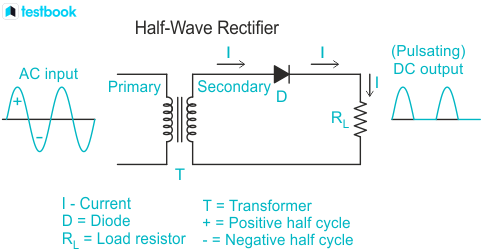
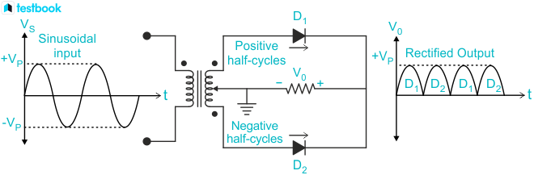

# Application of diodes in rectification

A rectifier is made using one or more diodes to convert alternating current into direct current. Diodes allow current flow in one direction. This unique property of diodes allows them to behave as a rectifier by converting AC to DC.

**Half wave rectifier**: When alternating current (AC) is allowed to pass through a diode, it allows current to pass only in one direction. The process is because the diode is in the forward bias for the one-half cycle of alternating current and reverse bias for the other half cycle of AC. In reverse bias, it provides high resistance, so current is not allowed to flow. However, during the forward bias, it has very low resistance and current flows. During the alternate half-cycles, only the half-wave is obtained; that is why it is called a half-wave rectifier.

**Full-wave rectifier**: A full-wave rectifier converts the complete cycle of alternating current into the pulsating direct current signal. The main difference between the half-wave and full-wave rectifiers is that full-wave rectifiers use the complete AC signals and convert them into DC signals. Conversely, the half-wave rectifier uses only half of the AC signal and converts it into a DC signal.

## Working Principle of Diode as a Rectifier
### As a Half-Wave Rectifier:
A half-wave rectifier comprises a transformer, a P-N junction diode, and a load resistor. The complete working of a half-wave rectifier needs two cycles, i.e., both positive and negative cycles.
* The diode is connected to the forward bias during the positive half cycle. The current is conducted to the load resistance and the voltage established across the diode.
* The diode is in reverse bias condition during the negative half cycle. Hence, the current flows across the circuit are zero, and there is no movement in the circuit.
* The net voltage established across the diode is only during the positive half cycle of the circuit, and we will get pulsating DC voltage across the load resistor.

The below figure shows the half-wave rectifier, AC input voltage, and DC output voltage.

### As a Full-Wave Rectifier
A full-wave rectifier is made up of a transformer, two diodes, and load resistance. Four diodes can also be used in full-wave rectifiers, commonly called bridge rectifiers. A full-wave rectifier uses both halves of AC input. The anodes of the center-tapped diodes are connected to the load resistor and secondary winding of the transformer.
* Diode D1 will be connected in the forward bias, and diode D2 will be in reverse bias during the positive half cycle of AC. So, current flows through diode D1 and is blocked by diode D2.
* Diode D2 will be connected in the forward bias, and diode D1 will be in reverse bias during the negative half cycle of AC. So, current flows through diode D2 and is blocked by diode D1.
* In a full-wave rectifier, DC voltage is obtained for both positive and negative half cycles of AC input.

The below figure shows the full-wave rectifier, AC input voltage, and DC output voltage.

## Application of Diodes as a Rectifier
Diodes as rectifiers have many applications. Some of them are mentioned below:
* Diodes as rectifiers are used in power rectification, such as turning AC voltage into DC voltage.
* Diodes detect the amplitude of modulated radio signals, which helps us listen to radio clearly.
* Diodes as rectifiers are also used in lighting systems.
* Half-wave rectifiers are also used to detect the peak of the incoming waveform or a signal.
* Full-wave bridge rectifiers are used to supply polarized voltage in weldings.

We hope this article has provided the readers with an insight into the topic of Diode as a Rectifier. You can also check out some more interesting Physics topics. For more conceptual understanding and better scores, download the Testbook app today. Testbook will help to create a better learning experience.
