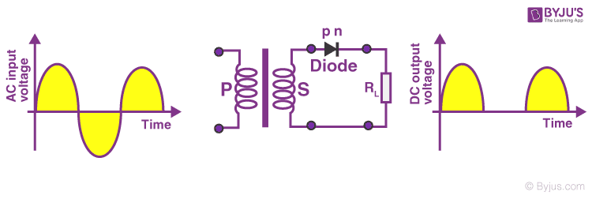
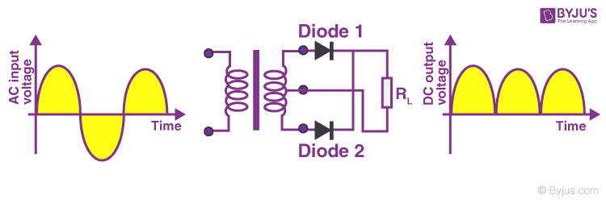

# Half wave Full wave rectifier and Factors determining rectifier performance

## Diode as a Rectifier: Half Wave Rectifier and Full Wave Rectifier

The main application of p-n junction diode is in rectification circuits. These circuits are used to describe the conversion of a.c signals to d.c in power supplies. Diode rectifier gives an alternating voltage which pulsates in accordance with time. The filter smoothes the pulsation in the voltage and to produce d.c voltage, a regulator is used which removes the ripples.

There are two primary methods of diode rectification:
* Half Wave Rectifier
* Full Wave Rectifier

### What Is Half Wave Rectifier?
In a half-wave rectifier, one half of each a.c input cycle is rectified. When the p-n junction diode is forward biased, it gives little resistance and when it is reversed biased it provides high resistance. During one-half cycles, the diode is forward biased when the input voltage is applied and in the opposite half cycle, it is reverse biased. During alternate half-cycles, the optimum result can be obtained.

### Working of Half Wave Rectifier
The half-wave rectifier has both positive and negative cycles. During the positive half of the input, the current will flow from positive to negative which will generate only a positive half cycle of the a.c supply. When a.c supply is applied to the transformer, the voltage will be decreasing at the secondary winding of the diode. All the variations in the a.c supply will reduce, and we will get the pulsating d.c voltage to the load resistor.

In the second half cycle, the current will flow from negative to positive and the diode will be reverse biased. Thus, at the output side, there will be no current generated, and we cannot get power at the load resistance. A small amount of reverse current will flow during reverse bias due to minority carriers.

### Characteristics of Half Wave Rectifier
Following are the characteristics of half-wave rectifier:
#### Ripple Factor
Ripples are the oscillations that are obtained in DC which are corrected by using filters such as inductors and capacitors. These ripples are measured with the help of the ripple factor and are denoted by γ. Ripple factor tells us the number of ripples presents in the output DC. Higher the ripple factor, more is the oscillation at the output DC and lower is the ripple factor, less is the oscillation at the output DC.

**Ripple factor is the ratio of RMS value of the AC component of the output voltage to the DC component of the output voltage.**

<math xmlns="http://www.w3.org/1998/Math/MathML">
  <mtable columnalign="left" columnspacing="1em" rowspacing="4pt">
    <mtr>
      <mtd>
        <mi>&#x3B3;</mi>
        <mo>=</mo>
        <msqrt>
          <mo stretchy="false">(</mo>
          <mfrac>
            <msub>
              <mi>V</mi>
              <mrow data-mjx-texclass="ORD">
                <mi>r</mi>
                <mi>m</mi>
                <mi>s</mi>
              </mrow>
            </msub>
            <msub>
              <mi>V</mi>
              <mrow data-mjx-texclass="ORD">
                <msub>
                  <mi></mi>
                  <mrow data-mjx-texclass="ORD">
                    <mi>D</mi>
                    <mi>C</mi>
                  </mrow>
                </msub>
              </mrow>
            </msub>
          </mfrac>
          <msup>
            <mo stretchy="false">)</mo>
            <mrow data-mjx-texclass="ORD">
              <mn>2</mn>
            </mrow>
          </msup>
          <mo>&#x2212;</mo>
          <mn>1</mn>
        </msqrt>
      </mtd>
    </mtr>
  </mtable>
</math>

#### DC Current
DC current is given as:

<math xmlns="http://www.w3.org/1998/Math/MathML">
  <mtable columnalign="left" columnspacing="1em" rowspacing="4pt">
    <mtr>
      <mtd>
        <msub>
          <mi>I</mi>
          <mrow data-mjx-texclass="ORD">
            <mi>D</mi>
            <mi>C</mi>
          </mrow>
        </msub>
        <mo>=</mo>
        <mfrac>
          <msub>
            <mi>I</mi>
            <mrow data-mjx-texclass="ORD">
              <mi>m</mi>
              <mi>a</mi>
              <mi>x</mi>
            </mrow>
          </msub>
          <mi>&#x3C0;</mi>
        </mfrac>
      </mtd>
    </mtr>
  </mtable>
</math>

Where,
* Imax is the maximum DC load current

#### DC Output Voltage

The output DC voltage appears at the load resistor RL which is obtained by multiplying output DC voltage with the load resistor RL. The output DC voltage is given as:

<math xmlns="http://www.w3.org/1998/Math/MathML">
  <mtable columnalign="left" columnspacing="1em" rowspacing="4pt">
    <mtr>
      <mtd>
        <msub>
          <mi>V</mi>
          <mrow data-mjx-texclass="ORD">
            <mi>D</mi>
            <mi>C</mi>
          </mrow>
        </msub>
        <mo>=</mo>
        <mfrac>
          <msub>
            <mi>V</mi>
            <mrow data-mjx-texclass="ORD">
              <mi>S</mi>
              <mi>m</mi>
              <mi>a</mi>
              <mi>x</mi>
            </mrow>
          </msub>
          <mi>&#x3C0;</mi>
        </mfrac>
      </mtd>
    </mtr>
  </mtable>
</math>

Where,
* VSmax is the maximum secondary voltage

#### Form Factor
The form factor is the ratio of RMS value to the DC value. **For a half-wave rectifier, the form factor is 1.57.**
#### Rectifier Efficiency
Rectifier efficiency is the ratio of output DC power to the input AC power. **For a half-wave rectifier, rectifier efficiency is 40.6%.**
### Advantages of Half Wave Rectifier
* Affordable
* Simple connections
* Easy to use as the connections are simple
* Number of components used are less

### Disadvantages of Half Wave Rectifier
* Ripple production is more
* Harmonics are generated
* Utilization of the transformer is very low
* The efficiency of rectification is low

### Applications of Half Wave Rectifier
Following are the uses of half-wave rectification:
* **Power rectification**: Half wave rectifier is used along with a transformer for power rectification as powering equipment.
* **Signal demodulation**: Half wave rectifiers are used for demodulating the AM signals.
* **Signal peak detector**: Half wave rectifier is used for detecting the peak of the incoming waveform.

### What Is Full Wave Rectifier?
Full-wave rectifier circuits are used for producing an output voltage or output current which is purely DC. The main advantage of a full-wave rectifier over half-wave rectifier is that such as the average output voltage is higher in full-wave rectifier, there is less ripple produced in full-wave rectifier when compared to the half-wave rectifier.

### Working of Full Wave Rectifier
The full-wave rectifier utilizes both halves of each a.c input. When the p-n junction is forward biased, the diode offers low resistance and when it is reverse biased it gives high resistance. The circuit is designed in such a manner that in the first half cycle if the diode is forward biased then in the second half cycle it is reverse biased and so on.

### Characteristics of Full Wave Rectifier
Following are the characteristics of full-wave rectifier:
#### Ripple Factor
Ripple factor for a full-wave rectifier is given as:

<math xmlns="http://www.w3.org/1998/Math/MathML">
  <mtable columnalign="left" columnspacing="1em" rowspacing="4pt">
    <mtr>
      <mtd>
        <mi>&#x3B3;</mi>
        <mo>=</mo>
        <msqrt>
          <mo stretchy="false">(</mo>
          <mfrac>
            <msub>
              <mi>V</mi>
              <mrow data-mjx-texclass="ORD">
                <mi>r</mi>
                <mi>m</mi>
                <mi>s</mi>
              </mrow>
            </msub>
            <msub>
              <mi>V</mi>
              <mrow data-mjx-texclass="ORD">
                <mi>D</mi>
                <mi>C</mi>
              </mrow>
            </msub>
          </mfrac>
          <msup>
            <mo stretchy="false">)</mo>
            <mrow data-mjx-texclass="ORD">
              <mn>2</mn>
            </mrow>
          </msup>
          <mo>&#x2212;</mo>
          <mn>1</mn>
        </msqrt>
      </mtd>
    </mtr>
  </mtable>
</math>

#### DC Current
Currents from both the diodes D1 and D2 are in the same direction when they flow towards load resistor RL. The current produced by both the diodes is the ratio of Imax to π, therefore the DC current is given as:

<math xmlns="http://www.w3.org/1998/Math/MathML">
  <mtable columnalign="left" columnspacing="1em" rowspacing="4pt">
    <mtr>
      <mtd>
        <msub>
          <mi>I</mi>
          <mrow data-mjx-texclass="ORD">
            <mi>D</mi>
            <mi>C</mi>
          </mrow>
        </msub>
        <mo>=</mo>
        <mfrac>
          <mrow>
            <mn>2</mn>
            <msub>
              <mi>I</mi>
              <mrow data-mjx-texclass="ORD">
                <mi>m</mi>
                <mi>a</mi>
                <mi>x</mi>
              </mrow>
            </msub>
          </mrow>
          <mi>&#x3C0;</mi>
        </mfrac>
      </mtd>
    </mtr>
  </mtable>
</math>

Where,
* Imax is the maximum DC load current

#### DC Output Voltage
DC output voltage is obtained at the load resistor RL and is given as:

<math xmlns="http://www.w3.org/1998/Math/MathML">
  <mtable columnalign="left" columnspacing="1em" rowspacing="4pt">
    <mtr>
      <mtd>
        <msub>
          <mi>V</mi>
          <mrow data-mjx-texclass="ORD">
            <mi>D</mi>
            <mi>C</mi>
          </mrow>
        </msub>
        <mo>=</mo>
        <mfrac>
          <mrow>
            <mn>2</mn>
            <msub>
              <mi>V</mi>
              <mrow data-mjx-texclass="ORD">
                <mi>m</mi>
                <mi>a</mi>
                <mi>x</mi>
              </mrow>
            </msub>
          </mrow>
          <mi>&#x3C0;</mi>
        </mfrac>
      </mtd>
    </mtr>
  </mtable>
</math>

Where,
* Vmax is the maximum secondary voltage

#### Form Factor
The form factor is the ratio of RMS value of current to the output DC voltage. The form factor of a full-wave rectifier is given as 1.11

#### Rectifier Efficiency
Rectifier efficiency is used as a parameter to determine the efficiency of the rectifier to convert AC into DC. It is the ratio of DC output power to the AC input power. The rectifier **efficiency of a full-wave rectifier is 81.2%.**

### Types of Full Wave Rectifier
There are two main types of full-wave rectifiers, and they are:
* **Two diodes full-wave rectifier circuit** (requires a center-tapped transformer and is used in vacuum tubes)
* **Bridge rectifier circuit** (doesn’t require a centre-tapped transformer and is used along with transformers for efficient usage)

### Advantages of Full Wave Rectifier
* The rectifier efficiency of a full-wave rectifier is high
* The power loss is very low
* Number of ripples generated are less

### Disadvantages of Full Wave Rectifier
* Very expensive

### Applications of Full Wave Rectifier
Following are the uses of full-wave rectifier:
* Full-wave rectifiers are used for supplying polarized voltage in welding and for this bridge rectifiers are used.
* Full-wave rectifiers are used for detecting the amplitude of modulated radio signals.

### Difference between Half Wave Rectifier and Full Wave Rectifier
| Parameter  | Half Wave Rectifier | Full Wave Rectifier |
|------------|---------------------|---------------------|
| Definition | The half-wave rectifier is a rectifier which is used for converting the one-half cycle of AC input to DC output | A full-wave rectifier is a rectifier which is used for converting both the half cycles of AC input into DC output|
| No. of diodes used | 1 | 2 or 4 depending on the type of circuit |
| Form factor | 1.57 | 1.11 |
| Rectifier efficiency | 40.6% | 81.2% |
| Ripple factor | Ripple factor of a half-wave rectifier is more | Ripple factor of a full-wave rectifier is less |

### Frequently Asked Questions – FAQs
1. Why half-wave rectifiers are not used in dc power supply?
* Half-wave rectifiers are not used in dc power supply because the supply provided by the half-wave rectifier is not satisfactory.
1. What is PIV of a diode in a rectifier circuit?
* PIV stands for peak inverse voltage and it is the maximum voltage that is possible to occur across the diode when it is operated in reverse biased.
1. What is a ripple in a rectifier circuit?
* Ripple is defined as the ac component that has a pulsating output in a rectifier.
1. What are the advantages of a bridge rectifier over a center-tapped full-wave rectifier?
* Following are the three advantages of bridge rectifier over a center-tapped full-wave rectifier:
    * The TUF of a bridge rectifier is 81.2% while the TUF of a center-tapped is 67.2%.
    * The output of the bridge rectifier is twice that of the center-tapped full-wave rectifier.
    * A bridge rectifier as a PIV half of the center-tapped full-wave rectifier.

1. What is the cycle followed by the current in a full-wave rectifier?
In a full-wave rectifier, the current flows in the half cycle of the input signal.
1. What happens to the peak current if the value of the shunt capacitor filter is increased?
When the value of the shunt capacitor filter is increased, the peak current will also increase in a rectifying diode.
1. Why bridge rectifier is preferred over an ordinary two diodes full-wave rectifier?
* A bridge rectifier is preferred over an ordinary two diodes full-wave rectifier because:
    * The PIV is less per diode
    * There is no need for the centre tap
    * The transformer required is smaller with the same output
