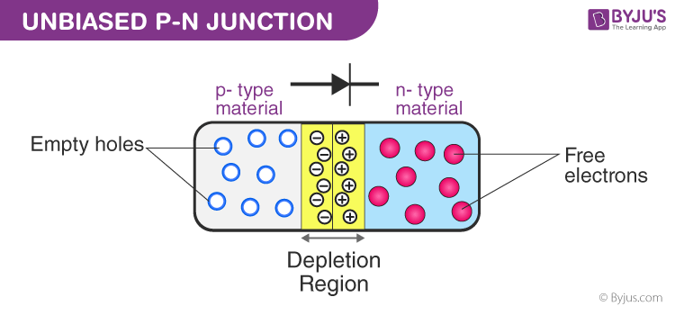
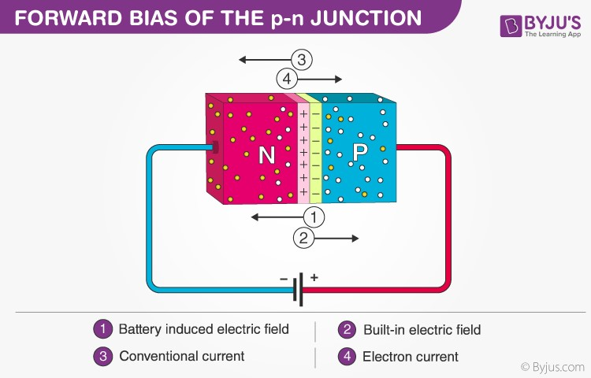
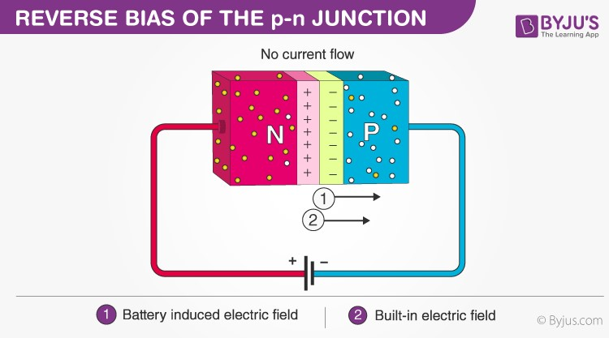
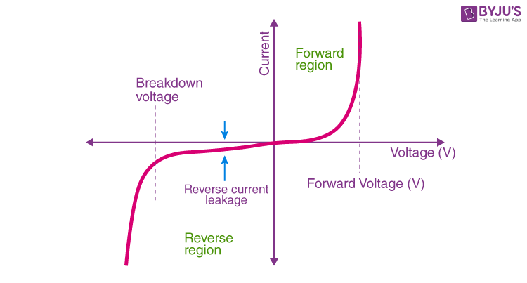

# PN junction diode

## What is P-N Junction?
**Definition**: A P-N junction is an interface or a boundary between two semiconductor material types, namely the p-type and the n-type, inside a semiconductor.

In a semiconductor, the P-N junction is created by the method of doping. The p-side or the positive side of the semiconductor has an excess of holes, and the n-side or the negative side has an excess of electrons. The process of doping is explained in further detail in the next section.

## Formation of P-N Junction
As we know, if we use different semiconductor materials to make a P-N junction, there will be a grain boundary that would inhibit the movement of electrons from one side to the other by scattering the electrons and holes and thus, we use the process of doping. We will understand the process of doping with the help of this example. Let us consider a thin p-type silicon semiconductor sheet. If we add a small amount of pentavalent impurity to this, a part of the p-type Si will get converted to n-type silicon. This sheet will now contain both the p-type region and the n-type region and a junction between these two regions. The processes that follow after forming a P-N junction are of two types – diffusion and drift. There is a difference in the concentration of holes and electrons at the two sides of a junction. The holes from the p-side diffuse to the n-side, and the electrons from the n-side diffuse to the p-side. These give rise to a diffusion current across the junction.

Also, when an electron diffuses from the n-side to the p-side, an ionised donor is left behind on the n-side, which is immobile. As the process goes on, a layer of positive charge is developed on the n-side of the junction. Similarly, when a hole goes from the p-side to the n-side, an ionized acceptor is left behind on the p-side, resulting in the formation of a layer of negative charges in the p-side of the junction. This region of positive charge and negative charge on either side of the junction is termed as the depletion region. Due to this positive space charge region on either side of the junction, an electric field with the direction from a positive charge towards the negative charge is developed. Due to this electric field, an electron on the p-side of the junction moves to the n-side of the junction. This motion is termed the drift. Here, we see that the direction of the drift current is opposite to that of the diffusion current.

## Biasing Conditions for the P-N Junction Diode
There are two operating regions in the P-N junction diode:
* P-type
* N-type

There are three biasing conditions for the P-N junction diode, and this is based on the voltage applied:
* Zero bias: No external voltage is applied to the P-N junction diode.
* Forward bias: The positive terminal of the voltage potential is connected to the p-type while the negative terminal is connected to the n-type.
* Reverse bias: The negative terminal of the voltage potential is connected to the p-type and the positive is connected to the n-type.

## Forward Bias

When the p-type is connected to the battery’s positive terminal and the n-type to the negative terminal, then the P-N junction is said to be forward-biased. When the P-N junction is forward biased, the built-in electric field at the P-N junction and the applied electric field are in opposite directions. When both the electric fields add up, the resultant electric field has a magnitude lesser than the built-in electric field. This results in a less resistive and thinner depletion region. The depletion region’s resistance becomes negligible when the applied voltage is large. In silicon, at the voltage of 0.6 V, the resistance of the depletion region becomes completely negligible, and the current flows across it unimpeded.

When the p-type is connected to the battery’s negative terminal and the n-type is connected to the positive side, the P-N junction is reverse biased. In this case, the built-in electric field and the applied electric field are in the same direction. When the two fields are added, the resultant electric field is in the same direction as the built-in electric field, creating a more resistive, thicker depletion region. The depletion region becomes more resistive and thicker if the applied voltage becomes larger.

## P-N Junction Formula
The formula used in the P-N junction depends upon the built-in potential difference created by the electric field is given as:

<math xmlns="http://www.w3.org/1998/Math/MathML">
  <mtable columnalign="left" columnspacing="1em" rowspacing="4pt">
    <mtr>
      <mtd>
        <msub>
          <mi>E</mi>
          <mrow data-mjx-texclass="ORD">
            <mn>0</mn>
          </mrow>
        </msub>
        <mo>=</mo>
        <msub>
          <mi>V</mi>
          <mrow data-mjx-texclass="ORD">
            <mi>T</mi>
          </mrow>
        </msub>
        <mi>l</mi>
        <mi>n</mi>
        <mo stretchy="false">[</mo>
        <mfrac>
          <mrow>
            <msub>
              <mi>N</mi>
              <mrow data-mjx-texclass="ORD">
                <mi>D</mi>
              </mrow>
            </msub>
            <mo>.</mo>
            <msub>
              <mi>N</mi>
              <mrow data-mjx-texclass="ORD">
                <mi>A</mi>
              </mrow>
            </msub>
          </mrow>
          <msubsup>
            <mi>n</mi>
            <mrow data-mjx-texclass="ORD">
              <mi>i</mi>
            </mrow>
            <mrow data-mjx-texclass="ORD">
              <mn>2</mn>
            </mrow>
          </msubsup>
        </mfrac>
        <mo stretchy="false">]</mo>
      </mtd>
    </mtr>
  </mtable>
</math>

Where,
* E0 is the zero bias junction voltage
* VT is the thermal voltage of 26mV at room temperature
* ND and NA are the impurity concentrations
* ni is the intrinsic concentration.

## How does current flow in the PN junction diode?
The flow of electrons from the n-side towards the p-side of the junction takes place when there is an increase in the voltage. Similarly, the flow of holes from the p-side towards the n-side of the junction takes place along with the increase in the voltage. This results in the concentration gradient between both sides of the terminals. Due to the concentration gradient formation, charge carriers will flow from higher-concentration regions to lower-concentration regions. The movement of charge carriers inside the P-N junction is the reason behind the current flow in the circuit.

## V-I Characteristics of P-N Junction Diode

VI characteristics of P-N junction diodes is a curve between the voltage and current through the circuit. Voltage is taken along the x-axis while the current is taken along the y-axis. The above graph is the V-I characteristics curve of the P-N junction diode. With the help of the curve, we can understand that there are three regions in which the diode works, and they are:
* Zero bias
* Forward bias
* Reverse bias

When the P-N junction diode is in zero bias condition, there is no external voltage applied and this means that the potential barrier at the junction does not allow the flow of current.

When the P-N junction diode is in forward bias condition, the p-type is connected to the positive terminal while the n-type is connected to the negative terminal of the external voltage. When the diode is arranged in this manner, there is a reduction in the potential barrier. For silicone diodes, when the voltage is 0.7 V and for germanium diodes, when the voltage is 0.3 V, the potential barriers decrease, and there is a flow of current. 

When the diode is in forward bias, the current increases slowly, and the curve obtained is non-linear as the voltage applied to the diode overcomes the potential barrier. Once the diode overcomes the potential barrier, the diode behaves normally, and the curve rises sharply as the external voltage increases, and the curve obtained is linear.

When the P-N junction diode is in negative bias condition, the p-type is connected to the negative terminal while the n-type is connected to the positive terminal of the external voltage. This results in an increase in the potential barrier. Reverse saturation current flows in the beginning as minority carriers are present in the junction. 

When the applied voltage is increased, the minority charges will have increased kinetic energy which affects the majority charges. This is the stage when the diode breaks down. This may also destroy the diode.

## Applications of P-N Junction Diode
* P-N junction diode can be used as a photodiode as the diode is sensitive to the light when the configuration of the diode is reverse-biased.
* It can be used as a solar cell.
* When the diode is forward-biased, it can be used in LED lighting applications.
* It is used as rectifier in many electric circuits and as a voltage-controlled oscillator in varactors.

## Frequently Asked Questions – FAQs
1. What happens when the battery voltage is increased in a forward-biased P-N junction?
    - The current through the junction increases when the battery voltage is increased in a forward-biased P-N junction.
1. What happens when a P-N junction is reverse biased?
    - The holes and electrons tend to move away from the junction.
1. What are the two breakdown mechanisms of the P-N junction?
    - The two breakdown mechanisms are Zener breakdown and Avalanche breakdown.
1. What is the static resistance of a diode?
    - Static resistance of a diode is defined as the ratio of the DC voltage applied across the diode to the DC current flowing through the diode.
1. What is the dynamic resistance of a diode?
    - Dynamic resistance of a diode is defined as the ratio of change in voltage to the change in current.
1. What is reverse resistance?
    - Reverse resistance is defined as the resistance offered by the P-N junction diode when it is reverse biased.
1. What is a semiconductor?
    - A semiconductor is a material whose conductivity stays between an insulator and a conductor.
1. What are the two types of semiconductors?
    - N-type semiconductors and p-type semiconductors are the two types of semiconductors.
1. What are n-type semiconductors?
    - N-type semiconductors are intrinsic semiconductors doped with antimony (Sb), phosphorus (P), or arsenic (As) as doping impurities.
1. What is meant by doping?
    - In semiconductor technology, doping is the process of intentional infliction of impurities into intrinsic semiconductors for the objective of remodelling their optical, structural, and electrical properties.
1. What is a diode?
    - A diode is an electrical device that enables the current to flow only in one direction. In an electrical circuit diagram, a diode is denoted by a triangle symbol with a line along one vertex.
1. What are the main types of diodes?
    - Light-emitting diode, avalanche diode, laser diode, Schottky diode, photodiode, p-n junction diode, and Zener diode are the main types of diodes.
1. What are the three regions in which diodes function?
    - Forward bias, zero bias and reverse bias are the three regions in which diodes function.
1. Give one application of P-N junction diodes.
    - P-N junction diodes are used as rectifiers in numerous electric circuits. They are also used as voltage-controlled oscillators in varactors.
