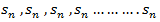
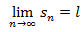
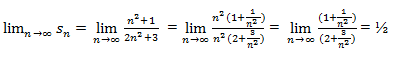
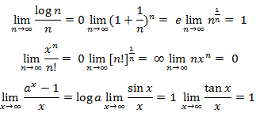
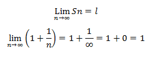

# Convergence of sequence and series

## Overview (sequence and series)

A function f : N  , where S is a non-empty set , is called sequence , for each nϵN.

We write sequence as f(1) , f(2) , f(3) , f(4)……….f(n).

Any sequence f(n) can be denoted as &lt;f(n)> or {f(n)} or (f(n)).

Suppose f(n) = sn

Then it can be written as –  and can be denoted as &lt;sn >or  {sn } or ( sn)

sn is the n’th term of the sequence.

Example:  suppose we have a sequence – 1 , 4 , 9 , 16 ,……….. and its n’th term is n2.

The sequence, we can write as  &lt;n2 >

## Types of sequences
1. **Finite sequence**- A sequence which has finite number of terms is finite sequence.
1. **Infinite sequence**-  A sequence which is not finite , called infinite sequence.

**Limit of a Sequence**– A sequence &lt;sn> is said to tend to limit “l” , when given any positive number ‘ϵ’ , however small , we can always find a integer ‘m’ such that |sn – l| &lt;ϵ , for every for all, n≥m , and we can define this as follows,

Example: If    , then the limit of  will be-

Hence the limit of the sequence is 1/2.

### Some important limits to remember for sequence and series

Convergent sequence- A sequence Sn is convergent when it tends to a finite limit. That means the limit of a sequence Sn will be always finite in case of convergent sequence.

Divergent sequence- when a sequence tends to ±∞ then it is divergent sequence.

Oscillatory sequence-  when a sequence neither converges nor diverges then it is an oscillatory sequence.

Note- a sequence which neither converges nor diverges , is called oscillatory sequence.

A sequence is null, when it converges to zero.

**Example-1:  consider a sequence 2, 3/2 , 4/3 , 5/4, …….. here Sn =  1 + 1/n**

Sol. As we can see that the sequence Sn is convergent and has limit 1.

According to def.

